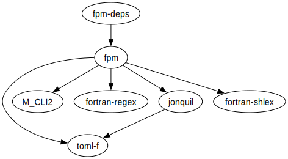

# fpmdeps

Generate dependency graphs of fpm projects

To start using `fpmdeps` run the commands:

```
> git clone ... && cd fpmdeps   # clone project
> fpm install --prefix ~/.local    # install in directory on the user PATH
> fpmdeps  # run fpmdeps in the root directory of an fpm project
```

The result can be piped to the Graphviz [`dot`](https://graphviz.org/doc/info/command.html) command, e.g.:

```
> fpmdeps | -Tsvg -ofpmdeps.svg
```
resulting in



## Acknowledgments

Thanks to [@vmagnin](https://github.com/vmagnin) for early testing via the fpm plugin mechanism and for pointing me toward the existing cargo crates.

## See also

- [cargo-depgraph](https://crates.io/crates/cargo-depgraph/)
- [cargo-deps](https://crates.io/crates/cargo-deps)
- [PkgGraph.jl](https://github.com/tfiers/PkgGraph.jl)
- [pipdeptree](https://pypi.org/project/pipdeptree/)
- [conda-tree](https://github.com/conda-incubator/conda-tree)
